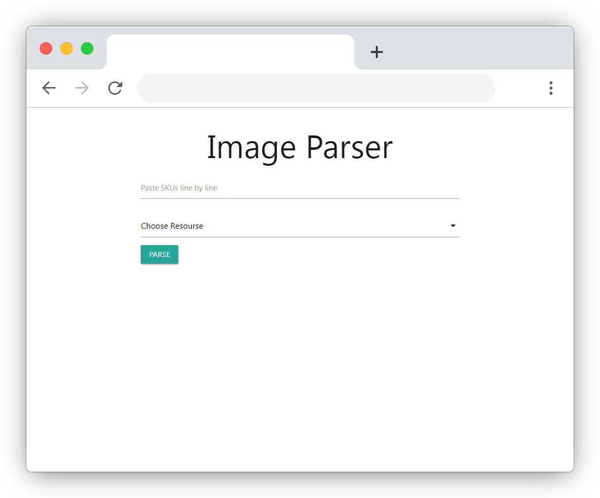
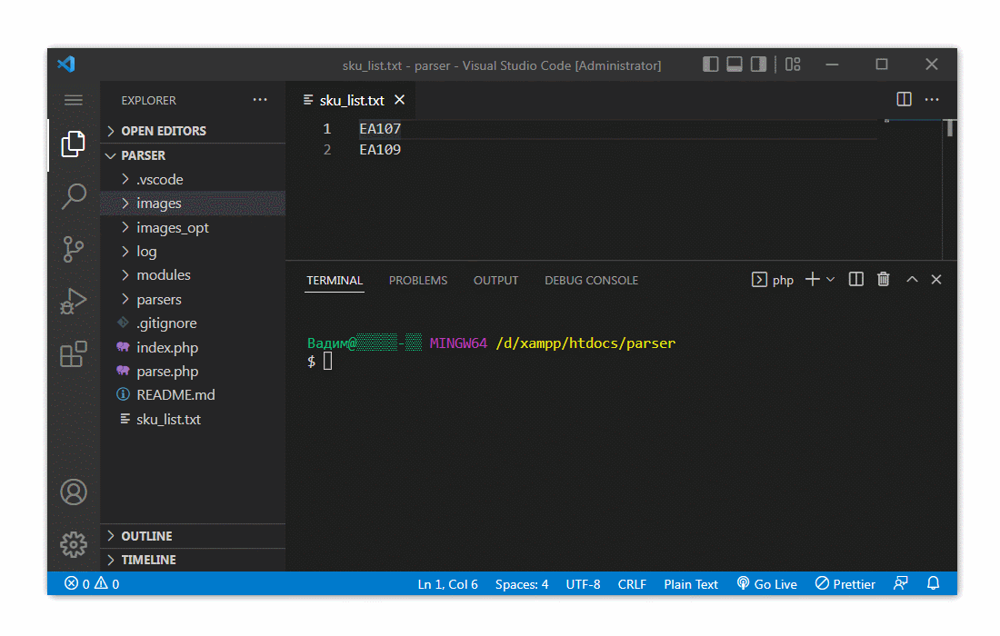

# Project Description

PHP utility (based on «PHP Simple HTML DOM Parser») for downloading and optimising images from certain resources. Parsing is possible by product SKU or category link.

This utility may run either via a web interface or CLI.

